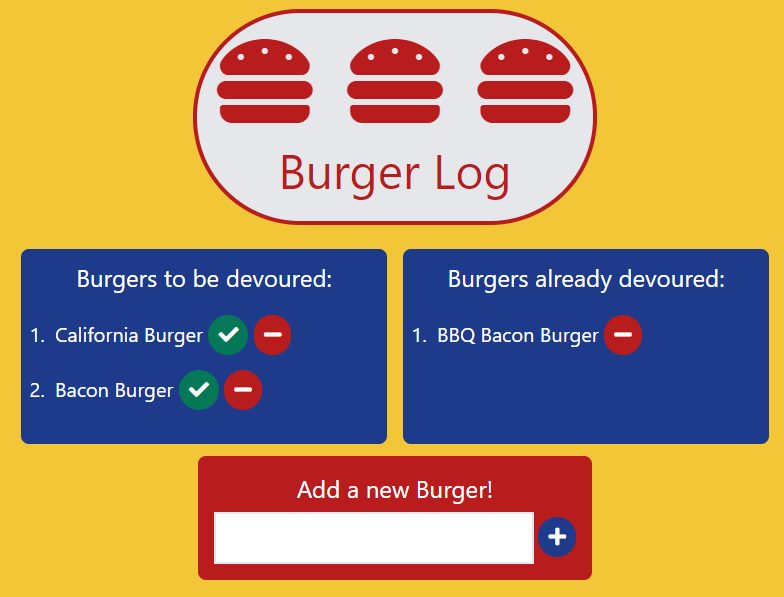

# Good Burger Log
This app allows you to keep track of burgers you have tried and would like to try

It has been deployed to Heroku: https://frozen-hollows-62628.herokuapp.com/

## Table of Contents

* [Walkthrough](#walkthrough)
* [Technologies](#technologies)
* [Future Enhancements](#future-enhancements)

## Walkthrough

To use this application, you can visit the deployed Heroku version here: https://frozen-hollows-62628.herokuapp.com/ or download the files from the repo.

1. Upon opening the application, you will be presented with a log of burgers: some marked to be devoured; some already devoured:

## Technologies

This application uses:
* Node.js
* Express
* Express Handlebars
* JAWSDB
* MYSQL
* CSS
* Tailwindcss
* JavaScript
* HTML

## Future Enhancements

### Add To Your Portfolio

After completing the homework please add the piece to your portfolio. Make sure to add a link to your updated portfolio in the comments section of your homework so the TAs can easily ensure you completed this step when they are grading the assignment. To receive an 'A' on any assignment, you must link to it from your portfolio.