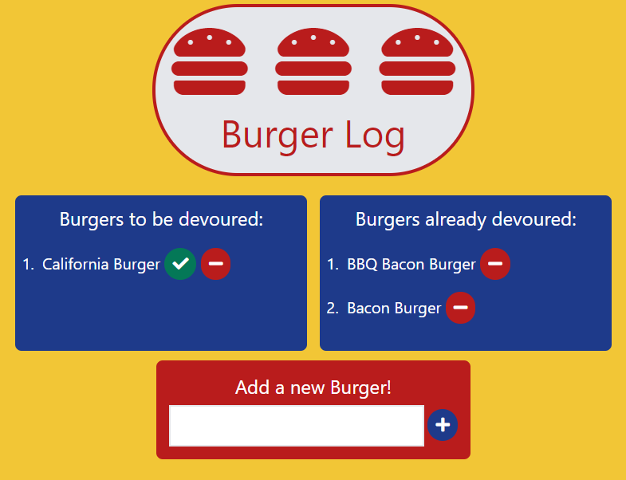

# Good Burger Log
This app allows you to keep track of burgers you have tried and would like to try.

It has been deployed to Heroku: https://frozen-hollows-62628.herokuapp.com/

## Table of Contents

* [Walkthrough](#walkthrough)
* [Technologies](#technologies)
* [Future Enhancements](#future-enhancements)

## Walkthrough

To use this application, you can visit the deployed Heroku version here: https://frozen-hollows-62628.herokuapp.com/ or download the files from the repo.

1. Upon opening the application, you will be presented with a log of burgers: some marked to be devoured; some already devoured:

2. Use the green checkmark to check burgers off the To be Devoured list and add them to the Already Devoured list:

3. Use the Add a new Burger form to enter a burger you would like to track:

4. Use the red minus buttons to remove burgers off either list:

## Technologies

This application uses:
* Node.js
* Express
* Express Handlebars
* JAWSDB
* MYSQL
* CSS
* Tailwindcss
* JavaScript
* HTML

## Future Enhancements

For future app enhancements, it would be nice to allow notes to be entered about each burger so you can remember where the burger was ordered and how you felt about it.  The UI also needs some work to become mobile-friendly so allowing the two lists to resize themselves is another item for a future release.